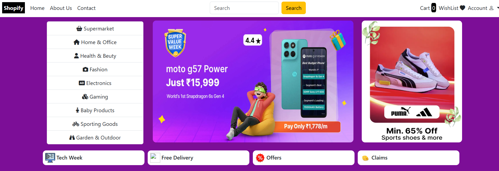
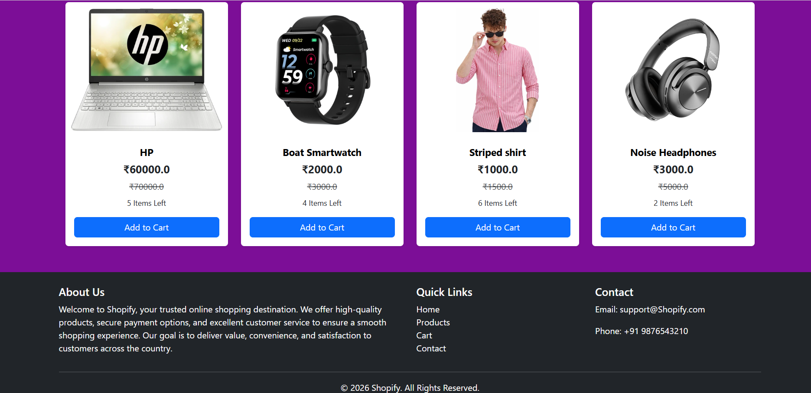
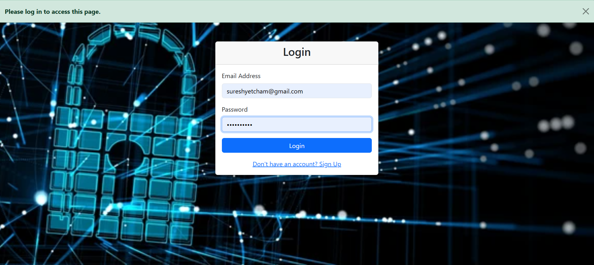
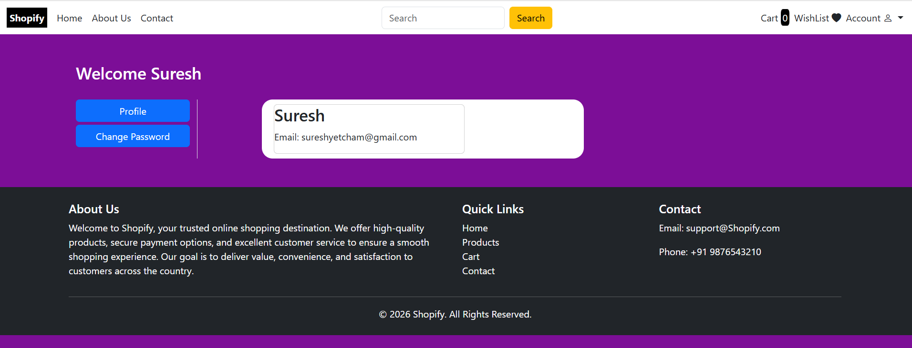
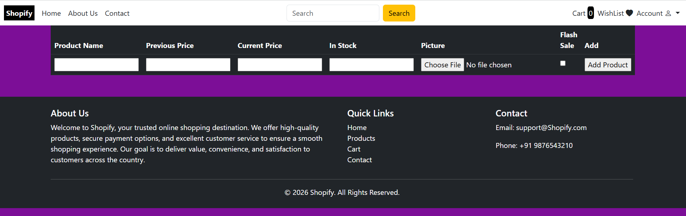
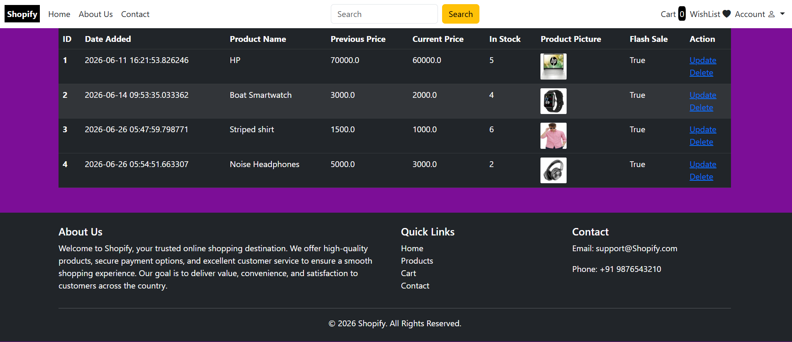
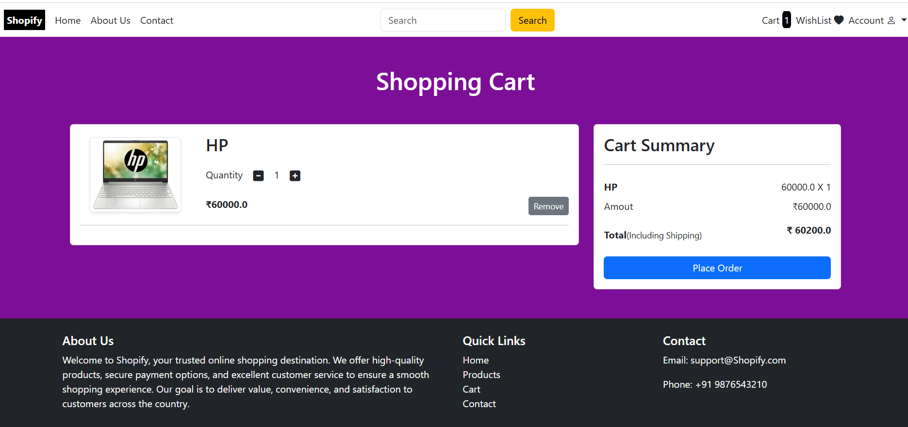
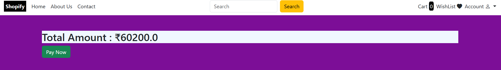

# 🛒 E-Commerce Website

<p align="center">


</p>

<h1 align="center">🛍️  E-Commerce Website</h1>

<p align="center">
A modern Full Stack E-Commerce web application developed using <b>Python Flask</b>, <b>SQLAlchemy</b>, <b>HTML</b>, <b>CSS</b>, <b>Bootstrap</b>, and <b>JavaScript</b>.
</p>

---

# 📌 Table of Contents

* Project Overview
* Features
* Technology Stack
* Project Architecture
* Folder Structure
* Installation
* Database Setup
* Running the Project
* Screenshots
* Future Improvements
* Skills Demonstrated
* Learning Outcomes
* Contribution
* License
* Developer

---

# 📖 Project Overview

The **Flask E-Commerce Website** is a full-stack web application designed to simulate a real-world online shopping platform. It enables users to create an account, browse products, manage their shopping cart, and place orders through a clean and responsive interface.

The application follows Flask best practices by separating authentication, database models, forms, payment handling, and administration into individual modules, making the project maintainable and scalable.

This project was developed to strengthen practical knowledge of **Python Full Stack Development**, including backend development, frontend integration, database management, and user authentication.

---

# ✨ Features

## 👤 User Features

* User Registration
* Secure Login & Logout
* Password Authentication
* Session Management
* Profile Management

## 🛍️ Shopping Features

* Browse Products
* Product Categories
* Product Details
* Add Products to Cart
* Remove Products from Cart
* Quantity Management

## 💳 Order Features

* Checkout Process
* Payment Module
* Order Confirmation

## ⚙️ Admin Features

* Product Management
* User Management
* Admin Dashboard
* Inventory Management

## 🎨 User Interface

* Responsive Design
* Bootstrap Components
* Mobile Friendly Layout
* Modern Navigation

---

# 🛠️ Technology Stack

| Category           | Technology                                             |
| ------------------ | ------------------------------------------------------ |
| Backend            | Python                                                 |
| Framework          | Flask                                                  |
| Database ORM       | SQLAlchemy                                             |
| Database           | SQLite
| Frontend           | HTML5                                                  |
| Styling            | CSS3                                                   |
| UI Framework       | Bootstrap 5                                            |
| Client-side        | JavaScript                                             |
| Template Engine    | Jinja2                                                 |
| Authentication     | Flask Sessions                                         |
| Version Control    | Git                                                    |
| Repository Hosting | GitHub                                                 |

---

## 🏗️ Project Architecture (MVC)

```text
                        User
                          │
                          ▼
                   Browser (Client)
                          │
                    HTTP Request
                          │
                          ▼
            Controller (Flask Routes)
      (main.py, auth.py, admin.py, payment.py)
                          │
                          ▼
               Model (SQLAlchemy ORM)
                     (models.py)
                          │
                          ▼
              Database (SQLite)
                          │
                          ▼
               Model Returns Data
                          │
                          ▼
          View (Jinja2 HTML Templates)
      (templates + static + Bootstrap)
                          │
                    HTTP Response
                          │
                          ▼
                         User
```


📁 Project Structure (MVC Architecture)

```text
python-flask-ecommerce/
│
├── 📁 static/                     # Static assets
│   ├── 📁 css/
│   ├── 📁 js/
│   ├── 📁 images/
│   └── 📁 uploads/
│
├── 📁 templates/                  # View (Jinja2 Templates)
│   ├── base.html
│   ├── index.html
│   ├── login.html
│   ├── register.html
│   ├── products.html
│   ├── cart.html
│   ├── checkout.html
│   └── admin/
│
├── 📁 media/                      # Product Images
│
├── 📄 main.py                     # Application Entry Point
│
├── 📄 auth.py                     # Controller - User Authentication
├── 📄 admin.py                    # Controller - Admin Operations
├── 📄 payment.py                  # Controller - Payment Processing
├── 📄 forms.py                    # Forms & Input Validation
│
├── 📄 models.py                   # Model - Database Models
│
├── 📄 requirements.txt            # Project Dependencies
├── 📄 .gitignore                  # Ignored Files
├── 📄 README.md                   # Project Documentation
└── 📄 database.db                 # MySQL Database
🏗️ MVC Mapping
MVC Component	Files
Model	models.py, database.db
View	templates/, static/, media/
Controller	main.py, auth.py, admin.py, payment.py, forms.py
```

---

# ⚙️ Installation

## Clone the Repository

```bash
git clone https://github.com/sureshyetcham/Python-Flask-Ecommerce.git
```

```bash
cd Python-Flask-Ecommerce
```

---

# 🐍 Create a Virtual Environment

### Windows

```bash
python -m venv venv
```

Activate

```bash
venv\Scripts\activate
```

---

### Linux / macOS

```bash
python3 -m venv venv
```

Activate

```bash
source venv/bin/activate
```

---

# 📦 Install Dependencies

```bash
pip install -r requirements.txt
```

---

# 🗄️ Database Configuration

Configure your SQLAlchemy database URI inside your Flask application.

Example:

```python
SQLALCHEMY_DATABASE_URI = "sqlite:///database.db"
```

---

# ▶️ Run the Application

```bash
python main.py
```

Open your browser

```text
http://127.0.0.1:5000
```

---
# 📸 Screenshots

## 🏠 Home Page



---

## 🛍️ products HomePage



---

## 🔐 Login Page



---
## 🔐 Signup Page


---
## 🔐 profile Page



---
## 🔐 Admin Page



---
## 🔐 Admin Dashboard



---
## 🛒 Shopping Cart



---
## 🔐 payment




# 🚀 Future Improvements

* Email Verification
* Forgot Password via Email
* Product Wishlist
* Product Reviews & Ratings
* Coupon & Discount System
* Order Tracking
* Invoice Generation
* REST API Development
* Docker Support
* Cloud Deployment
* AI-Based Product Recommendation

---

# 💡 Skills Demonstrated

This project demonstrates practical knowledge of:

* Python Programming
* Flask Framework
* SQLAlchemy ORM
* Authentication & Authorization
* CRUD Operations
* Database Design
* Session Management
* Bootstrap UI Development
* Responsive Web Design
* Object-Oriented Programming
* Git & GitHub
* Full Stack Web Development
* Problem Solving

---

# 📚 Learning Outcomes

Through this project, I gained hands-on experience in:

* Developing a complete Full Stack web application.
* Building scalable Flask applications.
* Designing relational databases.
* Managing user authentication.
* Implementing CRUD functionality.
* Creating responsive user interfaces.
* Organizing Flask applications into modular components.
* Using Git and GitHub for version control.
* Debugging and testing web applications.

---

# 🤝 Contribution

Contributions are welcome.

To contribute:

1. Fork this repository.
2. Create a new feature branch.
3. Commit your changes.
4. Push your branch.
5. Create a Pull Request.

---

# 📄 License

This project is licensed under the MIT License.

---

# 👨‍💻 Developer

## Suresh Yetcham

**Python Full Stack Developer**

📧 Email

> sureshyetcham@gmail.com

🔗 LinkedIn

> https://www.linkedin.com/in/sureshyetcham099/

🐙 GitHub

> https://github.com/sureshyetcham

---

# 🌟 If You Like This Project

If you found this project useful,

⭐ Star this repository

🍴 Fork this repository

📢 Share it with others

---

<p align="center">

### Thank you for visiting my repository! ❤️

**Built with Python • Flask • SQLAlchemy • HTML • CSS • Bootstrap • JavaScript**

</p>
